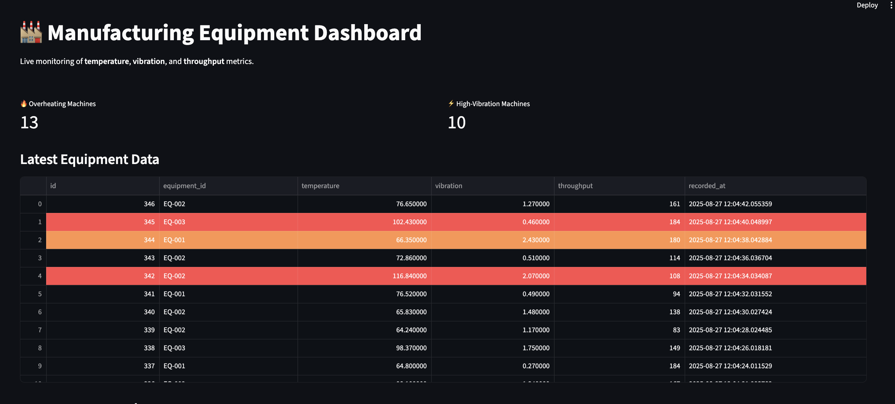
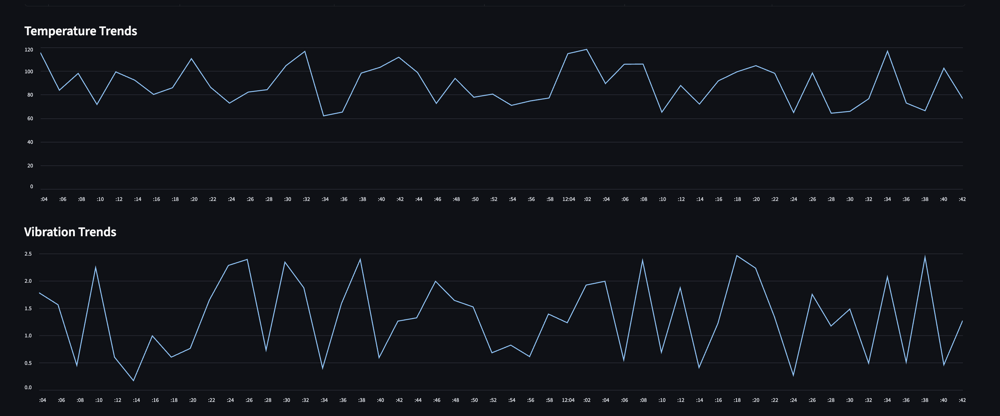
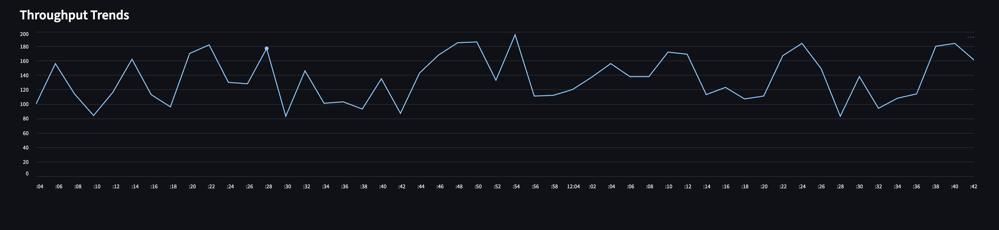

# 🏭 Manufacturing Equipment Dashboard


[](https://manufacturing-equipment-dashboard.streamlit.app)

---

## 🌐 Live Demo
Try the app here: [**Manufacturing Equipment Dashboard**](https://manufacturing-equipment-dashboard.streamlit.app)

---

## 📝 About the Project
This project demonstrates **real-time IoT-style monitoring** for manufacturing equipment.  
It showcases **data streaming**, **PostgreSQL integration**, **alert automation**,  
and a responsive **Streamlit dashboard** — ideal for industrial environments.

---

## 🚀 Features
- 📊 **Live data visualization** for equipment metrics  
- 🔴 **Automatic alert highlighting** for overheating or high vibration  
- ⏱️ **Auto-refresh every 5 seconds**  
- 🧪 **Mock data generation** via `mock_sensor.py`  
- 🐘 **PostgreSQL integration**  

---

## 🛠️ Tech Stack
- **Frontend:** [Streamlit](https://streamlit.io/)  
- **Backend:** Python + Psycopg2  
- **Database:** PostgreSQL  
- **Visualization:** Streamlit Charts + Pandas  

---

## 📂 Project Structure
```
manufacturing-equipment-dashboard/
├── scripts/
│   ├── dashboard.py      # Streamlit dashboard
│   ├── mock_sensor.py    # Mock data generator
├── assets/               # Screenshots & docs
├── requirements.txt      # Python dependencies
└── README.md
```

---

## ⚡ Setup Instructions

### **1. Clone the Repo**
```bash
git clone https://github.com/jennyle0421/Manufacturing-Equipment-Dashboard.git
cd Manufacturing-Equipment-Dashboard
```

### **2. Create a Virtual Environment (Optional but Recommended)**
```bash
python3 -m venv venv
source venv/bin/activate   # On Mac/Linux
venv\Scripts\activate      # On Windows
```

### **3. Install Dependencies**
```bash
pip install -r requirements.txt
```

### **4. Set Up PostgreSQL Database**
```bash
# Open PostgreSQL shell
psql -U postgres

# Create database
CREATE DATABASE equipment_db;

# Connect to the database
\c equipment_db;

# Create the table
CREATE TABLE equipment_data (
    id SERIAL PRIMARY KEY,
    equipment_id VARCHAR(50),
    temperature FLOAT,
    vibration FLOAT,
    throughput INT,
    timestamp TIMESTAMP DEFAULT CURRENT_TIMESTAMP
);
```

---

## 🧪 Generate Mock Data (Optional)
Run the mock data generator in a separate terminal:
```bash
python scripts/mock_sensor.py
```

---

## ▶️ Run the Dashboard
```bash
streamlit run scripts/dashboard.py
```

---

## 📸 Dashboard Preview

<p align="center">
  <br>
  <br>
  
</p>

---

## 📌 Requirements
- **Python** 3.9+
- **PostgreSQL** 13+
- **Streamlit** 1.20+
- Other dependencies listed in `requirements.txt`
